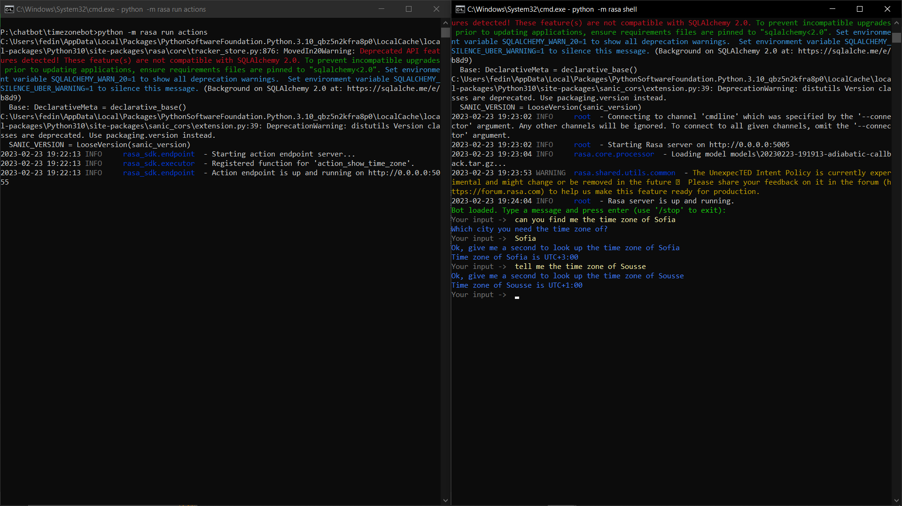
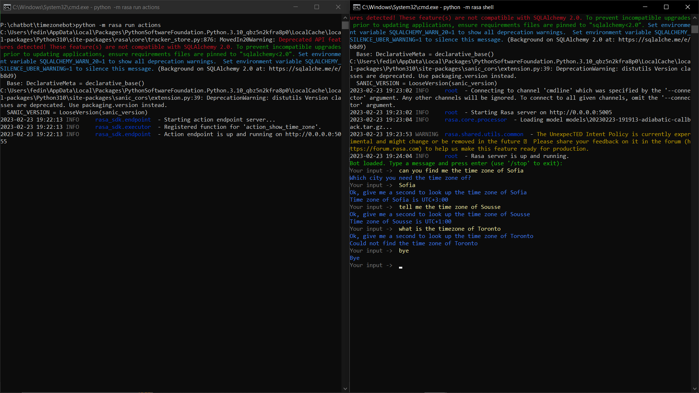
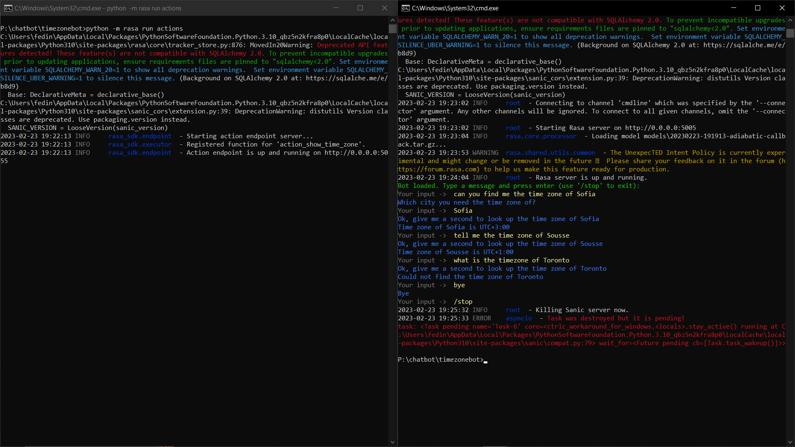

# Time Zone Bot

The time zone bot is bot created using the rasa framework, it shows an example of how to create a simple or even more complex chatbots with the rasa framework without
any need to have a deep understanding a chatbot.

This project is perfect for:
- People who are experienced in ML and ChatBot creations and want to learn new technologies
- As well as beginners in the field of chat bots and want to have a general understanding of how it works

# Installation:
**Recommended way**\
You need to have installed:
- [Pyhon 3.9 or above](https://www.python.org/downloads/release/python-390/)
- [Rasa](https://rasa.com/docs/rasa/installation/installing-rasa-open-source/)

If you want to or already have went through the hassle of installing Python and Rasa, you can ```git clone``` this repository, then ```cd Time-Zone-Bot```.

# Running the project:
- To train the model run ```rasa train```, if it doesn't work try running ```python -m rasa train```, otherwise check your installation.
- To run the model run ```rasa shell```, if it doesn't work try running ```python -m rasa shell``` to talk with the bot.
- to run the NLU model run ```rasa shell nlu```, if it doens't work try running ```python -m rasa shell nlu``` to see the accuracy and entities
- **Important**\
- run the custom actions before running the shell by ```rasa run actions```, if it doens't work ```python -m rasa run actions```.

# Screenshots



- to stop the running bot type: ```/stop```


